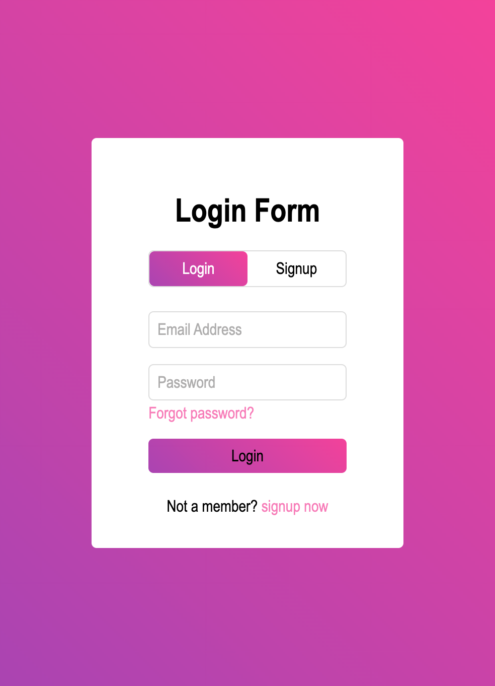
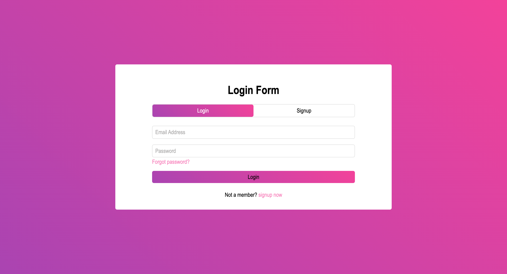

  <h1><b>SAIL LOGIN</b></h1>

<!-- TABLE OF CONTENTS -->

# 📗 Table of Contents

- [📗 Table of Contents](#-table-of-contents)
- [📖 Sail Login](#-sail-login)
  - [🛠 Built With ](#-built-with-)
    - [Tech Stack ](#tech-stack-)
    - [Key Features ](#key-features-)
  - [🚀 Live Demo ](#-live-demo-)
  - [💻 Getting Started ](#-getting-started-)
    - [Prerequisites](#prerequisites)
    - [Setup](#setup)
  - [👥 Authors ](#-authors-)
  - [🔭 Future Features ](#-future-features-)
  - [🤝 Contributing ](#-contributing-)
  - [⭐️ Show your support ](#️-show-your-support-)
  - [🙏 Acknowledgments ](#-acknowledgments-)
  - [📝 License ](#-license-)

<!-- PROJECT DESCRIPTION -->

# 📖 <a name="about-project">Sail Login</a>

|Mobile|Desktop|
|---|---|
|||

> This is a project which converts an image of a login page to code. You can see the image and the project requirements in this <a href="https://docs.google.com/document/d/1bMnTYvVGmO80trGjCHNvOMrG0cOaOdVhounVpR0LQZo/edit" name="project-file" >file</a>
>


## 🛠 Built With <a name="built-with"></a>

### Tech Stack <a name="tech-stack"></a>

<details>
  <summary>Client</summary>
  <ul>
    <li>HTML</li>
    <li>CSS</li>
  </ul>
</details>

<!-- Features -->

### Key Features <a name="key-features"></a>

- A fully responsive beautiful login page

<p align="right">(<a href="#readme-top">back to top</a>)</p>

<!-- LIVE DEMO -->

## 🚀 Live Demo <a name="live-demo"></a>

- [Live Demo Link](https://sail-login.netlify.app/)

<p align="right">(<a href="#readme-top">back to top</a>)</p>

<!-- GETTING STARTED -->

## 💻 Getting Started <a name="getting-started"></a>

### Prerequisites

In order to run this project you need:

- A terminal
- A code editor

### Setup

Clone this repository to your desired folder:

```sh
  cd my-folder
  git clone https://github.com/fobadara/sail-login.git
```


<p align="right">(<a href="#readme-top">back to top</a>)</p>

<!-- AUTHORS -->

## 👥 Authors <a name="authors"></a>

👤 **Fobadara**

- GitHub: [@foabadara](https://github.com/fobadara)
- Twitter: [@fob90s](https://twitter.com/fob90s)
- LinkedIn: [fobadara](https://linkedin.com/in/fobadara)

<p align="right">(<a href="#readme-top">back to top</a>)</p>

<!-- FUTURE FEATURES -->

## 🔭 Future Features <a name="future-features"></a>

> Describe 1 - 3 features you will add to the project.

- [ ] **Add more pages**
- [ ] **Add more animations to the project**

<p align="right">(<a href="#readme-top">back to top</a>)</p>

<!-- CONTRIBUTING -->

## 🤝 Contributing <a name="contributing"></a>

Contributions, issues, and feature requests are welcome!

Feel free to check the [issues page](../../issues/).

<p align="right">(<a href="#readme-top">back to top</a>)</p>

<!-- SUPPORT -->

## ⭐️ Show your support <a name="support"></a>

If you like this project give a ⭐️ and follow

<p align="right">(<a href="#readme-top">back to top</a>)</p>

<!-- ACKNOWLEDGEMENTS -->

## 🙏 Acknowledgments <a name="acknowledgements"></a>

I would like to thank my wife for her support. I would also like to thank Sail for giving me this opportunity.

<p align="right">(<a href="#readme-top">back to top</a>)</p>


<!-- LICENSE -->

## 📝 License <a name="license"></a>

This project is [MIT](./LICENSE) licensed.

<p align="right">(<a href="#readme-top">back to top</a>)</p>
